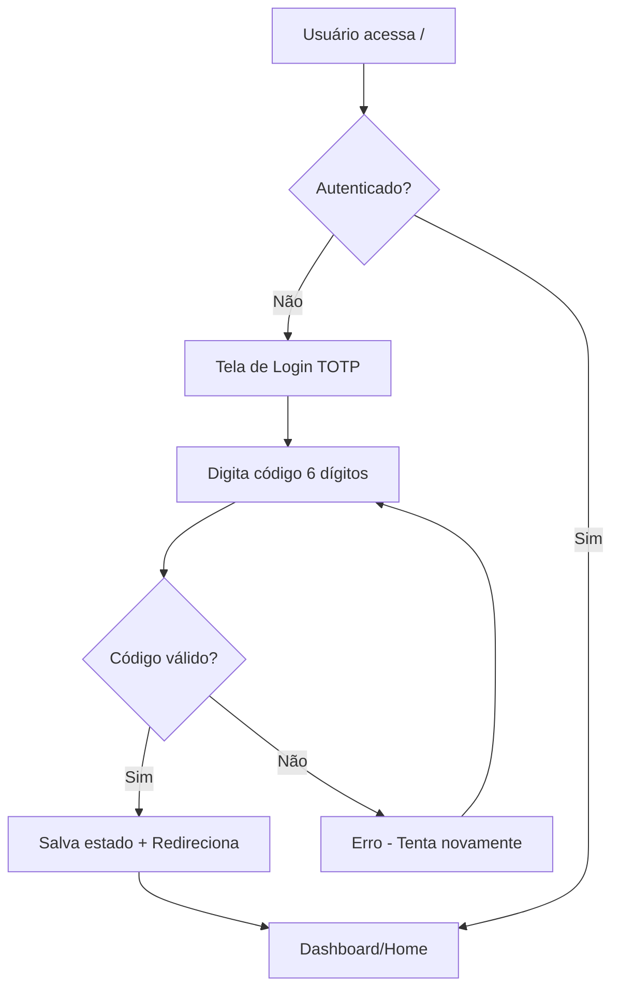

# 🔐 Sistema de Autenticação TOTP - Google Authenticator

## 📋 Visão Geral

O sistema agora possui autenticação de dois fatores (2FA) usando Google Authenticator com códigos TOTP (Time-based One-Time Password). Toda a aplicação está protegida por esta camada de segurança.

## 🚀 Como Usar

### 1. **Primeira Configuração**

1. **Acesse a página de geração de QR Code:**
   - URL: `http://localhost:8081/qrcodenovo`
   - Esta página não tem link na interface - acesso direto apenas

2. **Configure o Google Authenticator:**
   - Digite seu email (padrão: `admin@saudepublica.com`)
   - Clique em "Gerar QR Code"
   - Abra o Google Authenticator no celular
   - Escaneie o QR Code gerado
   - Sua conta será adicionada automaticamente

### 2. **Login no Sistema**

1. **Acesse a página inicial:**
   - URL: `http://localhost:8081/`
   - Será redirecionado automaticamente para a tela de login TOTP

2. **Digite o código de verificação:**
   - Email: `admin@saudepublica.com` (pré-preenchido)
   - Código: Digite o código de 6 dígitos do Google Authenticator
   - Clique em "Autenticar"

### 3. **Para Demonstração**

- **Código de teste:** Qualquer código de 6 dígitos funciona (ex: `123456`)
- **Email padrão:** `admin@saudepublica.com`

## 🛡️ Funcionalidades de Segurança

### ✅ **Implementado:**

1. **Proteção de Rotas:**
   - Todas as páginas principais protegidas por TOTP
   - Redirecionamento automático para login se não autenticado

2. **Gerenciamento de Sessão:**
   - Estado de autenticação persistido no localStorage
   - Logout limpa toda a sessão de segurança

3. **Interface Moderna:**
   - Tela de login responsiva e profissional
   - Página de geração de QR Code intuitiva
   - Botão de logout no navbar

4. **Integração com Supabase:**
   - Tabelas de usuários e sessões criadas
   - Funções SQL para TOTP implementadas

### 🔧 **Componentes Criados:**

1. **`TOTPLogin.tsx`** - Tela de login com código TOTP
2. **`QRCodeGenerator.tsx`** - Página de geração de QR Code
3. **`ProtectedRoute.tsx`** - Componente de proteção de rotas
4. **Contexto atualizado** - AuthContext com métodos TOTP

## 📱 URLs Importantes

| Página | URL | Descrição |
|--------|-----|-----------|
| **Login** | `/` | Tela principal de autenticação TOTP |
| **QR Code** | `/qrcodenovo` | Geração de QR Code (sem link na interface) |
| **Dashboard** | `/dashboard` | Acesso após autenticação |

## 🔑 Fluxo de Autenticação

## 🎯 Demonstração

### **Para testar rapidamente:**

1. **Acesse:** `http://localhost:8081/`
2. **Digite:** Qualquer código de 6 dígitos (ex: `123456`)
3. **Clique:** "Autenticar"
4. **Resultado:** Acesso liberado ao sistema completo

### **Para configuração real:**

1. **Acesse:** `http://localhost:8081/qrcodenovo`
2. **Configure:** Google Authenticator com QR Code
3. **Use:** Códigos reais do aplicativo

## 🔒 Segurança

- **Códigos TOTP:** Renovam a cada 30 segundos
- **Sessão persistente:** Mantém login até logout manual
- **Proteção total:** Todas as rotas principais protegidas
- **Logout seguro:** Limpa todos os dados de autenticação

## 🛠️ Tecnologias Utilizadas

- **React + TypeScript**
- **Supabase** (banco de dados e autenticação)
- **QRCode.js** (geração de QR codes)
- **Tailwind CSS** (estilização)
- **React Router** (roteamento protegido)

---

**Sistema de autenticação TOTP implementado com sucesso! 🚀🔐**
